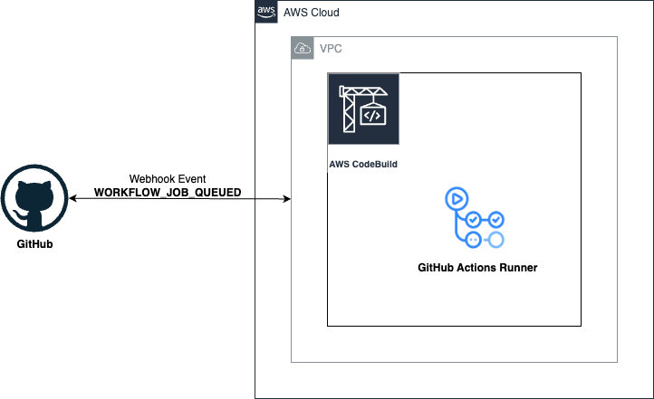

# Self-hosted GitHub Actions runners in AWS CodeBuild

Terraform module to set up [self-hosted GitHub Actions runners](https://docs.github.com/en/actions/hosting-your-own-runners/managing-self-hosted-runners/about-self-hosted-runners) in [AWS CodeBuild](https://docs.aws.amazon.com/codebuild/latest/userguide/welcome.html) containers to process [GitHub Actions](https://docs.github.com/en/actions/writing-workflows/quickstart) workflow jobs.

This module is mainly based in [Use self-hosted GitHub Actions runners in AWS CodeBuild](https://docs.aws.amazon.com/codebuild/latest/userguide/action-runner.html) and has been configured to support a [webhook at the organization level](https://docs.aws.amazon.com/codebuild/latest/userguide/github-global-organization-webhook-setup.html).

To use GitHub Actions self-hosted runners in CodeBuild, [update your GitHub Actions workflow YAML file in GitHub](https://docs.aws.amazon.com/codebuild/latest/userguide/sample-github-action-runners.html#sample-github-action-runners-update-yaml).

**Table of Contents:**

- [Self-hosted GitHub Actions runners in AWS CodeBuild](#self-hosted-github-actions-runners-in-aws-codebuild)
  - [Solution Overview](#solution-overview)
  - [Important Notes](#important-notes)
    - [GitHub Integration](#github-integration)
      - [Fined-grained Personal Access Token Permissions](#fined-grained-personal-access-token-permissions)
    - [Configuring the CodeBuild Environment](#configuring-the-codebuild-environment)
    - [VPC Configuration](#vpc-configuration)
  - [Usage](#usage)
  - [Requirements](#requirements)
  - [Providers](#providers)
  - [Modules](#modules)
  - [Resources](#resources)
  - [Inputs](#inputs)
  - [Outputs](#outputs)

## Solution Overview

A CodeBuild project is configured to set up self-hosted GitHub Actions runners in CodeBuild containers to process GitHub Actions workflow jobs. This is done by setting up a webhook using a CodeBuild project, and updating the GitHub Actions workflow YAML to use self-hosted runners hosted on CodeBuild machines.



The GitHub self-hosted runners will be created as an ephemeral runner in the repository that made the request event `WORKFLOW_JOB_QUEUED` and the `runs-on` setting in your GitHub workflow must set [according the expected format by AWS CodeBuild](https://docs.aws.amazon.com/codebuild/latest/userguide/sample-github-action-runners.html#sample-github-action-runners-update-yaml), otherwise the request won't be processed.

The high-level steps to configure a CodeBuild project to run GitHub Actions jobs are as follows:

1. Create a personal access token to connect the CodeBuild project to GitHub.
2. Create a CodeBuild project with a webhook and set up the webhook with the `WORKFLOW_JOB_QUEUED` event filter.
3. [Update your GitHub Actions workflow YAML in GitHub to configure your build environment](https://docs.aws.amazon.com/codebuild/latest/userguide/sample-github-action-runners.html#sample-github-action-runners-update-yaml).

## Important Notes

- By default CodeBuild logs are stored in AWS CloudWatch in the `/aws/codebuild/<code_project_name>` log group. To change this, set the `input_codebuild_logs_config` input variable.
- All resources with tags support, will be tagged with the following tags as default:
  - `Terraform`: indicates the resources is managed by Terraform. Value `true`.
  - `TerraformWorkspace`: indicates the current [Terraform's workspace](https://www.terraform.io/cli/workspaces). If no workspace is used, the value is `default`.

  Additional tags can be defined by setting the `tags` input variable, e.g.:

    ```hcl
    tags = {
      Project = "MyProject"
      TerraformModule = "MyModule"
    }
    ```

### GitHub Integration

When working with GitHub source CodeBuild webhooks, the CodeBuild service will automatically create (on `aws_codebuild_webhook` resource creation) and delete (on `aws_codebuild_webhook` resource deletion) the GitHub repository webhook using its granted OAuth permissions.

The AWS account that Terraform uses to create CodeBuild webhook must have authorized CodeBuild to access GitHub's OAuth API in each applicable region. ***This is a manual step that must be done before executing this Terraform module***. If OAuth is not configured, AWS will return an error similar to `ResourceNotFoundException: Could not find access token for server type github`.

OAuth can be configured by setting the default source credential for CodeBuild in the working region, e.g.: `https://eu-west-1.console.aws.amazon.com/codesuite/codebuild/sourceCredentials/default?provider=github&region=eu-west-1`. Three options are available:

- **GitHub App**: Connect project to GitHub using an AWS managed GitHub App.
- **Personal access token**: Connect project to GitHub using a personal access token.
- **OAuth App**: Connect project to GitHub using an OAuth App.

#### Fined-grained Personal Access Token Permissions

Create a fine-grained personal access token with the following permissions:

- **Repository permissions**:
  - `Contents`: Read-only. Grants access to private repositories.
  - `Commit statuses`: Read and write. Grants permission to create commit statuses.
  - `Webhooks`: Read and write. Grants permission to manage webhooks.
  - `Administration`: Read and write. Grants administration permissions on repositories.

- **Organization permission**:
  - `Webhooks`: Read and write. Grants permission to manage webhooks for an organization.

Then, save the token value in [AWS Secrets Manager](https://docs.aws.amazon.com/secretsmanager/latest/userguide/intro.html). The new secret must have the following keys and values (update the `<GH_PAT>` placeholder with the PAT value):

| Key  | Value   |
|------|---------|
| `ServerType` | `GITHUB` |
| `AuthType`| `PERSONAL_ACCESS_TOKEN` |
| `Token` | `<GH_PAT>` |

and the following tags:

| Key  | Value   |
|------|---------|
| `codebuild:source` | |
| `codebuild:source:provider`| `github` |
| `codebuild:source:type` | `personal_access_token` |

Using AWS CLI (update the `<GH_PAT>` placeholder with the PAT value):

```bash
export AWS_REGION="eu-west-1"

aws secretsmanager create-secret \
  --region "$AWS_REGION"\
  --name 'aws-codebuild-github-runners' \
  --description 'GitHub fined-access token' \
  --secret-string '{
                  "ServerType":"GITHUB",
                  "AuthType":"PERSONAL_ACCESS_TOKEN",
                  "Token":"<GH_PAT>"
                  }' \
  --tags Key=codebuild:source,Value='' \
         Key=codebuild:source:type,Value='github' \
         Key=codebuild:source:provider,Value='personal_access_token'
```

### Configuring the CodeBuild Environment

The CodeBuild environment is defined by the `codebuild_project_environment` input variable. Default values are suitable for most of the cases.

- Valid values for `codebuild_project_environment.compute_type` can be found in the [official documentation for `aws_codebuild_project` resource](https://registry.terraform.io/providers/hashicorp/aws/latest/docs/resources/codebuild_project#compute_type).
- Valid values for `codebuild_project_environment.image` can be found in [Compute images supported with the CodeBuild-hosted GitHub Actions runner](https://docs.aws.amazon.com/codebuild/latest/userguide/sample-github-action-runners-update-yaml.images.html). For the source code see [AWS CodeBuild curated Docker images](https://github.com/aws/aws-codebuild-docker-images/).
- Valid values for `codebuild_project_environment.type` can be found in the [official documentation for `aws_codebuild_project` resource](https://registry.terraform.io/providers/hashicorp/aws/latest/docs/resources/codebuild_project#type)

### VPC Configuration

This module is designed to create a CodeBuild project inside a VPC and provides access to private resources. The specified VPC must meet the following requirements:

- The subnet used by the CodeBuild project must provide outbound access. Private subnets with a NAT Gateway are highly recommended.
- The attached Security Group to the CodeBuild project must provide only outbound access to Internet.

For a full checklist see [best practices for VPCs](https://docs.aws.amazon.com/codebuild/latest/userguide/vpc-support.html#best-practices-for-vpcs).

## Usage

```hcl
module "codebuild_github_runners" {
  source = "../"

  codebuild_project_name        = "ghSelfhostedRunners"
  codebuild_project_description = "Uses CodeBuild to run GitHub Self-hosted Runners."
  github_organization_name      = "myorg"
  pat_aws_secret_name           = "aws-codebuild-github-runners"
  aws_region                    = "eu-west-1"

  codebuild_vpc_config = {
    security_group_ids = ["sg-abc"]
    subnets            = ["subnet-abc", "subnet-def", "subnet-ghi"]
    vpc_id             = "vpc-abc"
  }

  tags = {
    Project         = "CodeBuild GitHub Runners"
    TerraformModule = "codebuild_github_runners"
    Environment     = "Integrations"
  }
}
```

<!-- BEGIN_TF_DOCS -->
## Requirements

| Name | Version |
|------|---------|
| <a name="requirement_terraform"></a> [terraform](#requirement\_terraform) | >=1.5 |
| <a name="requirement_aws"></a> [aws](#requirement\_aws) | >=5.63.0 |

## Providers

| Name | Version |
|------|---------|
| <a name="provider_aws"></a> [aws](#provider\_aws) | 5.63.0 |

## Modules

No modules.

## Resources

| Name | Type |
|------|------|
| [aws_codebuild_project.this](https://registry.terraform.io/providers/hashicorp/aws/latest/docs/resources/codebuild_project) | resource |
| [aws_codebuild_webhook.this](https://registry.terraform.io/providers/hashicorp/aws/latest/docs/resources/codebuild_webhook) | resource |
| [aws_iam_policy.base](https://registry.terraform.io/providers/hashicorp/aws/latest/docs/resources/iam_policy) | resource |
| [aws_iam_policy.codebuild_cw_logs](https://registry.terraform.io/providers/hashicorp/aws/latest/docs/resources/iam_policy) | resource |
| [aws_iam_policy.codebuild_s3_logs](https://registry.terraform.io/providers/hashicorp/aws/latest/docs/resources/iam_policy) | resource |
| [aws_iam_policy.codebuild_vpc](https://registry.terraform.io/providers/hashicorp/aws/latest/docs/resources/iam_policy) | resource |
| [aws_iam_policy.secret_manager](https://registry.terraform.io/providers/hashicorp/aws/latest/docs/resources/iam_policy) | resource |
| [aws_iam_role.codebuild](https://registry.terraform.io/providers/hashicorp/aws/latest/docs/resources/iam_role) | resource |
| [aws_iam_role_policy_attachment.base](https://registry.terraform.io/providers/hashicorp/aws/latest/docs/resources/iam_role_policy_attachment) | resource |
| [aws_iam_role_policy_attachment.codebuild_cw_logs](https://registry.terraform.io/providers/hashicorp/aws/latest/docs/resources/iam_role_policy_attachment) | resource |
| [aws_iam_role_policy_attachment.codebuild_s3_logs](https://registry.terraform.io/providers/hashicorp/aws/latest/docs/resources/iam_role_policy_attachment) | resource |
| [aws_iam_role_policy_attachment.codebuild_vpc](https://registry.terraform.io/providers/hashicorp/aws/latest/docs/resources/iam_role_policy_attachment) | resource |
| [aws_iam_role_policy_attachment.secret_manager](https://registry.terraform.io/providers/hashicorp/aws/latest/docs/resources/iam_role_policy_attachment) | resource |
| [aws_caller_identity.current](https://registry.terraform.io/providers/hashicorp/aws/latest/docs/data-sources/caller_identity) | data source |
| [aws_secretsmanager_secret.pat](https://registry.terraform.io/providers/hashicorp/aws/latest/docs/data-sources/secretsmanager_secret) | data source |

## Inputs

| Name | Description | Type | Default | Required |
|------|-------------|------|---------|:--------:|
| <a name="input_aws_region"></a> [aws\_region](#input\_aws\_region) | The AWS region to provision the resources. | `string` | n/a | yes |
| <a name="input_codebuild_logs_config"></a> [codebuild\_logs\_config](#input\_codebuild\_logs\_config) | CodeBuild logs configuration.<br>  `cloudwatch_logs`: (Optional) Configuration to store logs on AWS CloudWatch.<br>    - `status`: Current status of logs in CloudWatch Logs for a build project. Valid values: `ENABLED`, `DISABLED`.<br>    - `group_name`: Group name of the logs in CloudWatch Logs.<br>    - `stream_name`: Prefix of the log stream name of the logs in CloudWatch Logs.<br>  `s3_logs`: (Optional) Configuration to store logs on AWS S3.<br>    - `status`: Current status of logs in S3 for a build project. Valid values: `ENABLED`, `DISABLED`.<br>    - `location`: Name of the S3 bucket and the path prefix for S3 logs. Must be set if status is ENABLED, otherwise it must be empty.<br>    - `encryption_disabled`: Whether to disable encrypting S3 logs. | <pre>object({<br>    cloudwatch_logs = optional(object({<br>      status      = string<br>      group_name  = string<br>      stream_name = string<br>    }))<br>    s3_logs = optional(object({<br>      status              = string<br>      location            = string<br>      encryption_disabled = bool<br>    }))<br>  })</pre> | `{}` | no |
| <a name="input_codebuild_project_description"></a> [codebuild\_project\_description](#input\_codebuild\_project\_description) | The description of the CodeBuild build project. | `string` | n/a | yes |
| <a name="input_codebuild_project_environment"></a> [codebuild\_project\_environment](#input\_codebuild\_project\_environment) | The CodeBuild environment configuration.<br>  `compute_type`: (Required) Information about the compute resources the build project will use.<br>  `image`: (Required) Docker image to use for this build project.<br>           Valid values include Docker images provided by CodeBuild, DockerHub images and full<br>           Docker repository URIs such as those for ECR.<br>  `type`: (Required) Type of build environment to use for related builds.<br>  `image_pull_credentials_type`: (Optional) Type of credentials AWS CodeBuild uses to pull images in your build.<br>  `privileged_mode`: (Optional) Whether to enable running the Docker daemon inside a Docker container. | <pre>object({<br>    compute_type                = string<br>    image                       = string<br>    type                        = string<br>    image_pull_credentials_type = optional(string, "CODEBUILD")<br>    privileged_mode             = optional(bool, true)<br>  })</pre> | <pre>{<br>  "compute_type": "BUILD_GENERAL1_SMALL",<br>  "image": "aws/codebuild/standard:7.0",<br>  "image_pull_credentials_type": "CODEBUILD",<br>  "privileged_mode": true,<br>  "type": "LINUX_CONTAINER"<br>}</pre> | no |
| <a name="input_codebuild_project_name"></a> [codebuild\_project\_name](#input\_codebuild\_project\_name) | The name of the CodeBuild build project. | `string` | n/a | yes |
| <a name="input_codebuild_vpc_config"></a> [codebuild\_vpc\_config](#input\_codebuild\_vpc\_config) | The VPC configuration to provision the CodeBuild Runners.<br>  `security_group_ids`: (Required) Security group IDs to assign to running builds.<br>  `subnets`: (Required) Subnet IDs within which to run builds.<br>  `vpc_id`: (Required) ID of the VPC within which to run builds. | <pre>object({<br>    security_group_ids = list(string)<br>    subnets            = list(string)<br>    vpc_id             = string<br>  })</pre> | n/a | yes |
| <a name="input_github_organization_name"></a> [github\_organization\_name](#input\_github\_organization\_name) | The name of the GitHub organization to add the webhook for AWS CodeBuild Runners. | `string` | n/a | yes |
| <a name="input_pat_aws_secret_name"></a> [pat\_aws\_secret\_name](#input\_pat\_aws\_secret\_name) | The name of the AWS Secret Manager secret with the personal access token with access to GitHub. | `string` | `""` | no |
| <a name="input_tags"></a> [tags](#input\_tags) | Tags added to all supported resources. | `map(any)` | `{}` | no |

## Outputs

| Name | Description |
|------|-------------|
| <a name="output_codebuild_webhook_payload_url"></a> [codebuild\_webhook\_payload\_url](#output\_codebuild\_webhook\_payload\_url) | The CodeBuild endpoint where webhook events are sent. |
| <a name="output_codebuild_webhook_url"></a> [codebuild\_webhook\_url](#output\_codebuild\_webhook\_url) | The URL to the webhook. |
<!-- END_TF_DOCS -->
